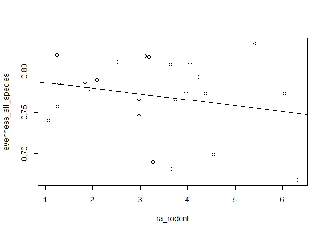

## Instructions
Answer the following questions and/or complete the exercises in RMarkdown. Please embed all of your code and push the final work to your repository. Your report should be organized, clean, and run free from errors. Remember, you must remove the `#` for any included code chunks to run.  

## Load the tidyverse

``` r
library("tidyverse")
library("janitor")
```

## Data 
For this assignment, we will use data from a study on vertebrate community composition and impacts from defaunation in [Gabon, Africa](https://en.wikipedia.org/wiki/Gabon). One thing to notice is that the data include 24 separate transects. Each transect represents a path through different forest management areas.  

Reference: Koerner SE, Poulsen JR, Blanchard EJ, Okouyi J, Clark CJ. Vertebrate community composition and diversity declines along a defaunation gradient radiating from rural villages in Gabon. _Journal of Applied Ecology_. 2016. This paper, along with a description of the variables is included inside the data folder.   

**1. Load `IvindoData_DryadVersion.csv` and store it as a new object called `gabon`.**

``` r
gabon <- read_csv("data/IvindoData_DryadVersion.csv")
```

```
## Rows: 24 Columns: 26
## ── Column specification ────────────────────────────────────────────────────────
## Delimiter: ","
## chr  (2): HuntCat, LandUse
## dbl (24): TransectID, Distance, NumHouseholds, Veg_Rich, Veg_Stems, Veg_lian...
## 
## ℹ Use `spec()` to retrieve the full column specification for this data.
## ℹ Specify the column types or set `show_col_types = FALSE` to quiet this message.
```

``` r
gabon <- clean_names(gabon)
```

**2. Use one or more of the summary functions you have learned to get an idea of the structure of the data.**  

``` r
glimpse(gabon)
```

```
## Rows: 24
## Columns: 26
## $ transect_id              <dbl> 1, 2, 2, 3, 4, 5, 6, 7, 8, 9, 13, 14, 15, 16,…
## $ distance                 <dbl> 7.14, 17.31, 18.32, 20.85, 15.95, 17.47, 24.0…
## $ hunt_cat                 <chr> "Moderate", "None", "None", "None", "None", "…
## $ num_households           <dbl> 54, 54, 29, 29, 29, 29, 29, 54, 25, 73, 46, 5…
## $ land_use                 <chr> "Park", "Park", "Park", "Logging", "Park", "P…
## $ veg_rich                 <dbl> 16.67, 15.75, 16.88, 12.44, 17.13, 16.50, 14.…
## $ veg_stems                <dbl> 31.20, 37.44, 32.33, 29.39, 36.00, 29.22, 31.…
## $ veg_liana                <dbl> 5.78, 13.25, 4.75, 9.78, 13.25, 12.88, 8.38, …
## $ veg_dbh                  <dbl> 49.57, 34.59, 42.82, 36.62, 41.52, 44.07, 51.…
## $ veg_canopy               <dbl> 3.78, 3.75, 3.43, 3.75, 3.88, 2.50, 4.00, 4.0…
## $ veg_understory           <dbl> 2.89, 3.88, 3.00, 2.75, 3.25, 3.00, 2.38, 2.7…
## $ ra_apes                  <dbl> 1.87, 0.00, 4.49, 12.93, 0.00, 2.48, 3.78, 6.…
## $ ra_birds                 <dbl> 52.66, 52.17, 37.44, 59.29, 52.62, 38.64, 42.…
## $ ra_elephant              <dbl> 0.00, 0.86, 1.33, 0.56, 1.00, 0.00, 1.11, 0.4…
## $ ra_monkeys               <dbl> 38.59, 28.53, 41.82, 19.85, 41.34, 43.29, 46.…
## $ ra_rodent                <dbl> 4.22, 6.04, 1.06, 3.66, 2.52, 1.83, 3.10, 1.2…
## $ ra_ungulate              <dbl> 2.66, 12.41, 13.86, 3.71, 2.53, 13.75, 3.10, …
## $ rich_all_species         <dbl> 22, 20, 22, 19, 20, 22, 23, 19, 19, 19, 21, 2…
## $ evenness_all_species     <dbl> 0.793, 0.773, 0.740, 0.681, 0.811, 0.786, 0.8…
## $ diversity_all_species    <dbl> 2.452, 2.314, 2.288, 2.006, 2.431, 2.429, 2.5…
## $ rich_bird_species        <dbl> 11, 10, 11, 8, 8, 10, 11, 11, 11, 9, 11, 11, …
## $ evenness_bird_species    <dbl> 0.732, 0.704, 0.688, 0.559, 0.799, 0.771, 0.8…
## $ diversity_bird_species   <dbl> 1.756, 1.620, 1.649, 1.162, 1.660, 1.775, 1.9…
## $ rich_mammal_species      <dbl> 11, 10, 11, 11, 12, 12, 12, 8, 8, 10, 10, 11,…
## $ evenness_mammal_species  <dbl> 0.736, 0.705, 0.650, 0.619, 0.736, 0.694, 0.7…
## $ diversity_mammal_species <dbl> 1.764, 1.624, 1.558, 1.484, 1.829, 1.725, 1.9…
```
  
**3. Use `mutate()` Change the variables `HuntCat`, `LandUse`, and `TransectID` to factors.**

``` r
gabon %>% 
  select(hunt_cat, land_use, transect_id) %>% 
  mutate(
      hunt_cat = factor(hunt_cat),
      land_use = factor(land_use),
      transect_id = factor(transect_id)
         )
```

```
## # A tibble: 24 × 3
##    hunt_cat land_use transect_id
##    <fct>    <fct>    <fct>      
##  1 Moderate Park     1          
##  2 None     Park     2          
##  3 None     Park     2          
##  4 None     Logging  3          
##  5 None     Park     4          
##  6 None     Park     5          
##  7 None     Park     6          
##  8 None     Logging  7          
##  9 High     Neither  8          
## 10 High     Logging  9          
## # ℹ 14 more rows
```

**4. Use `filter` to make three new dataframes focused only on 1. national parks, 2. logging concessions, and 3. neither. Have a look at the README in the data folder so you understand the variables.**

``` r
nationalparks <- filter(gabon, land_use == "Park")
loggingconcessions <- filter(gabon, land_use == "Logging")
neither <- filter(gabon, !land_use == "Park" & !land_use == "Logging")
```

**5. How many transects are recorded for each land use type?**

``` r
table(nationalparks$transect_id)
```

```
## 
##  1  2  4  5  6 24 
##  1  2  1  1  1  1
```

``` r
table(loggingconcessions$transect_id)
```

```
## 
##  3  7  9 13 14 16 18 19 20 22 25 26 27 
##  1  1  1  1  1  1  1  1  1  1  1  1  1
```

``` r
table(neither$transect_id)
```

```
## 
##  8 15 17 21 
##  1  1  1  1
```
National Parks: 6
Logging Concessions: 13
Neither: 4

**6. For which land use type (national parks, logging, or neither) is average all species diversity the greatest?**

``` r
mean(nationalparks$diversity_all_species)
```

```
## [1] 2.425143
```


``` r
mean(loggingconcessions$diversity_all_species)
```

```
## [1] 2.232538
```


``` r
mean(neither$diversity_all_species)
```

```
## [1] 2.3575
```
The average all species diversity is greatest for national parks.

**7. Use `filter` to find the transect that has the highest relative abundance of elephants. What land use type is this? Use `arrange()` to sort your results.** 

``` r
gabon %>%
  select(transect_id, ra_elephant, land_use) %>% 
  filter(ra_elephant == max(gabon$ra_elephant))
```

```
## # A tibble: 1 × 3
##   transect_id ra_elephant land_use
##         <dbl>       <dbl> <chr>   
## 1          18         2.3 Logging
```
Transect 18 has the highest relative abundance of elephants. It's primary land use is logging. I am not sure how we should use arrange here as there is only 1 result.

**8. Use `filter` to find all transects that have greater than 15 tree species or a breast height diameter between 50 and 60cm.  **

``` r
gabon %>% 
  select(transect_id, veg_rich, veg_dbh) %>% 
  filter(veg_rich > 15 | between(veg_dbh, 50, 60))
```

```
## # A tibble: 14 × 3
##    transect_id veg_rich veg_dbh
##          <dbl>    <dbl>   <dbl>
##  1           1     16.7    49.6
##  2           2     15.8    34.6
##  3           2     16.9    42.8
##  4           4     17.1    41.5
##  5           5     16.5    44.1
##  6           6     14.8    51.2
##  7           9     16      69.3
##  8          14     15.8    52.1
##  9          15     10.9    54.8
## 10          17     14.2    57.7
## 11          21     16.2    50.4
## 12          22     17.1    39.3
## 13          24     16.8    44.2
## 14          26     18.8    35.6
```

**9.Which transects and land use types have more than 10 tree species and 10 mammal species? Use `arrange()` to sort by the number of tree species.**

``` r
gabon %>% 
  select(transect_id, land_use, veg_rich, rich_mammal_species) %>% 
  filter(veg_rich > 10 & rich_mammal_species > 10) %>% 
  arrange(veg_rich)
```

```
## # A tibble: 9 × 4
##   transect_id land_use veg_rich rich_mammal_species
##         <dbl> <chr>       <dbl>               <dbl>
## 1           3 Logging      12.4                  11
## 2           6 Park         14.8                  12
## 3          14 Logging      15.8                  11
## 4           5 Park         16.5                  12
## 5           1 Park         16.7                  11
## 6          24 Park         16.8                  12
## 7           2 Park         16.9                  11
## 8           4 Park         17.1                  12
## 9          22 Logging      17.1                  12
```
Transects 1, 2, 3, 4, 5, 6, 14, 22, and 24 all fit the criteria. 1, 2, 4, 5, 6, and 24 are all national parks. 3, 14, and 22 are all logging concessions.

**10. Explore the data! Develop one question on your own that includes at least two lines of code. **

What is the relationship between the relative abundance of rodents and the large vertebrate community evenness?


``` r
rodent_v_even <- select(gabon, ra_rodent, evenness_all_species)
lm_rodent_v_even <- lm(evenness_all_species ~ ra_rodent, data = rodent_v_even)

gabon %>% 
  select(ra_rodent, evenness_all_species) %>% 
  plot

abline(lm_rodent_v_even)
```

<!-- -->


``` r
summary(lm_rodent_v_even)
```

```
## 
## Call:
## lm(formula = evenness_all_species ~ ra_rodent, data = rodent_v_even)
## 
## Residuals:
##      Min       1Q   Median       3Q      Max 
## -0.08624 -0.02631  0.00744  0.03512  0.07800 
## 
## Coefficients:
##              Estimate Std. Error t value Pr(>|t|)    
## (Intercept)  0.792848   0.023200   34.17   <2e-16 ***
## ra_rodent   -0.006996   0.006479   -1.08    0.292    
## ---
## Signif. codes:  0 '***' 0.001 '**' 0.01 '*' 0.05 '.' 0.1 ' ' 1
## 
## Residual standard error: 0.04573 on 22 degrees of freedom
## Multiple R-squared:  0.05032,	Adjusted R-squared:  0.007156 
## F-statistic: 1.166 on 1 and 22 DF,  p-value: 0.292
```

Based on the scatterplot and the line of best fit, there appears to be a weak negative association between the relative abundance of rodents and the species evenness of large vertebrates. After seeing the scatterplot, I checked the p-value of the linear regression and saw that it is 0.292 with 1 and 22 degrees of freedom. Because the p-value of 0.292 is greater than 0.05, I fail to reject the null hypothesis of no association between the relative abundance of rodents and the species evenness of large vertebrates.

## Knit and Upload
Please knit your work as a .pdf or .html file and upload to Canvas. Homework is due before the start of the next lab. No late work is accepted. Make sure to use the formatting conventions of RMarkdown to make your report neat and clean!  
